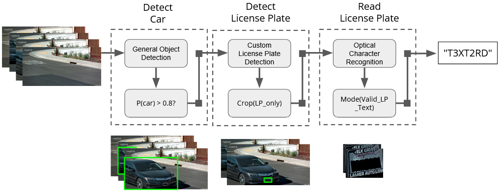

# Smart Home Security & Automatic License Plate Reader
Automatically detect and read license plates using open-sourced AI tools and Reolink's home-security cameras. The goal is to leverage existing pre-trained ML algorithms for practical AI-enhanced home-surveillance without the need to train or develop fine-tuned models/algorithms, to track and store detected events of interest, and to build custom alarm systems.

### Background & Motivation
Recently, a thief followed my mom home and robbed her as she was getting out of the car in the garage. Luckily, our neighbors had a security camera and we were able to identify the thief's license plate, leading to an arrest. The license plate was crucial for the police investigation and inspired this project to capture & store license plates events for the safety of my family's home and neighborhood.

## Overview
The goal was to detect and read license plates while leveraging existing tools/algorithms to minimize the need for training of ML models. This app leverages Reolink's built-in trigger functionality to upload videos to a designated FTP server only when a vehicle is detected using Reolink's [Smart Detection](https://support.reolink.com/hc/en-us/articles/900002812826-Introduction-to-Smart-Detection) feature, avoiding the computational complexity with continuous video stream and simultaneous machine learning processing. When a video is uploaded to the FTP server, the app initiates the automatic license plate reader (ALPR) to detect and read license plates using pre-trained machine learning models from [Codeproject.AI](https://www.codeproject.com/Articles/5322557/CodeProject-AI-Server-AI-the-easy-way), a framework that abstracts management of the AI-dev environment and exposes the AI models through a RESTful API. Finally, the inferred license plate characters and events are logged to a SQL database. 

### Automatic License Plate Reader (ALPR)
Initially, Codeproject.AI's built-in automatic licese plate reader module was used out-of-thebox; however, it generated a lot of false positives and did not accurately read the license text. To improve upon this, 3 different pre-trained vision detection models predictions were used to individually detect the cars, then the license plates, and lastly to read the license plates' text. The diagram below illustrate this process. 

First, each frame in the video is processed through Codeproject.AI's Object Detector (YOLOv5 6.2) to detect and localize the car. Each frame with probability > 80% of a car is processed through another Codeproject.AI module, the custom license plate detector. Finally, frames with detected license plates are cropped to license only and processed through Codeproject.AI's Optical Character Recognition module, PaddleOCR, which is used to read the license text. Each frame with a valid license plate text is counted and the license string with the most counts is determined to be the valid license plate reading for the given recording. 

## Getting Started
### Hardware
This project uses [Reolink Security Camera System with NVR with wired 12MP POE cameras](https://store.reolink.com/us/security-camera-systems/). Additionally, for further and smaller objects requiring finer resolution, [16x 4k Reolink camera](https://reolink.com/us/product/rlc-823a-16x/) is used as the primary camera for license plate detection and reading. A CUDA GPU-enabled computer/server with decent processing and storage is recommended as it will be used to host the FTP server, MySQL server, and Codeproject.AI's machine learning server.

### Setting up
- Install python >3.7 and .NET 7.0
    - install python packages in `python/requirements.txt`
- Install [Windows II7 and set-up a FTP server](https://learn.microsoft.com/en-us/iis/publish/using-the-ftp-service/configure-ftp-with-iis-manager-authentication-in-iis-7)
- Install and set-up Reolink cameras and software
    - set up [vehicle smart-detection](https://support.reolink.com/hc/en-us/articles/900002936246-How-to-Set-up-Smart-Person-Detection-Recording-only-via-Reolink-Client/) 
    - set up [FTP](https://support.reolink.com/hc/en-us/articles/900004645323-How-to-Upload-Continuous-Recording-to-FTP-on-POE-NVR-New-UI-/?source=search)
- Install MySQL and set-up databases
    - database.license_plates
    - database.camera_events 
- Install and set-up Codeproject.AI and modules
    - Object Detector (YOLOv5 6.2)
    - Optical Character Recognition (PaddleOCR)
- Build Home Security ALPR dotnet code for release

### How to use
- Start MySQL server
- Start FTP server
- Start Codeproject.AI server
- Start Home Security ALPR App
